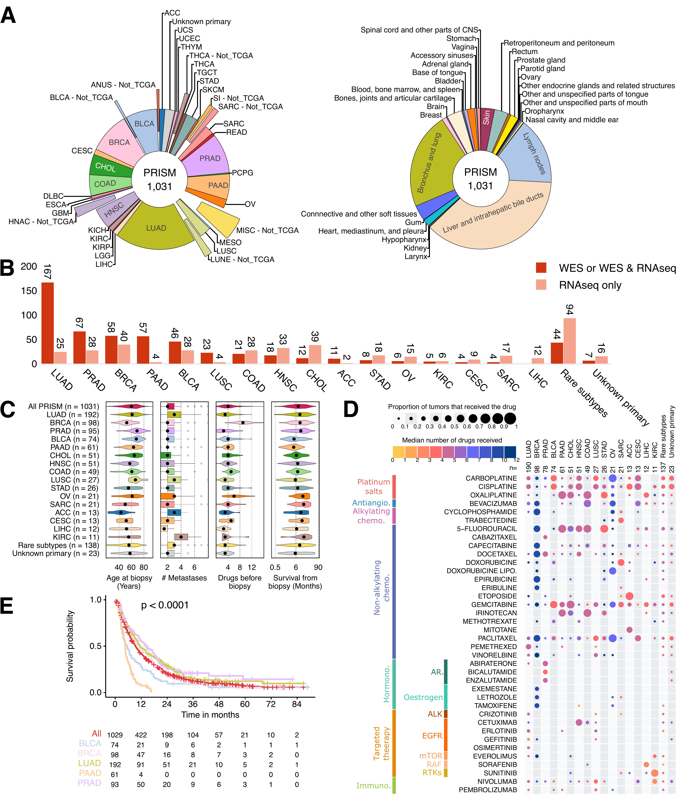

# META-PRISM
> PRISM (PRecISion Medicine Institute in Oncology)

META-PRISM is a project funded by [PRISM IHU](https://www.gustaveroussy.fr/fr/prism-ifi) under grant number
ANR-18-IBHU-0002 that aims at providing a genomic and transcriptomic landscape of tumors from patients refractory to
conventional treatmnents or with limited therapeutic
options (most notably, rare tumors).

All 1,031 patients included in the project were adult patients with solid tumor that were biopsied at entry into
the precision medicine trials MOSCATO - [NCT01566019](https://clinicaltrials.gov/ct2/show/NCT01566019); Massard et al.
Cancer Discov. 2017 - and MATCH-R - [NCT02517892](https://clinicaltrials.gov/ct2/show/NCT02517892); Recondo et al.
Precis. Onco. 2020.

The figure below provides a summary of the tumor types represented in the META-PRISM cohort as well as the distribution
of essential clinical characteristics.

# Contributors

Lead author and maintainer of the repository.
- Yoann Pradat <https://github.com/ypradat>
