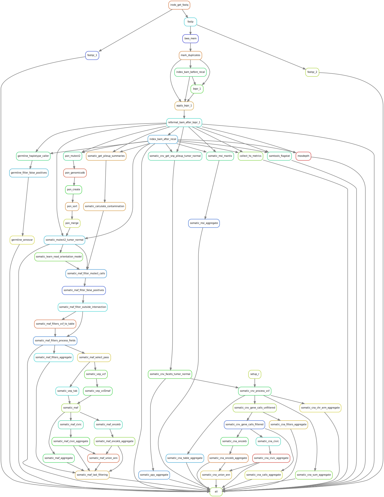

# Organisation

The workflow of the analysis is divided in rules that are assembled in the snakemake subfiles of `workflow/rules` which
are themselves included in the global snakemake file `workflow/Snakefile`. The rules call scripts located in the
`workflow/scripts` folder.

The parameters of the analysis may be modified in the `config/config.yaml` file. All libraries needed for running the
analysis are installed during the first steps of the pipeline through [conda virtual
environments](https://conda.io/projects/conda/en/latest/user-guide/tasks/manage-environments.html) whose specifications
are given in the folder `workflow/envs`.

# How to run the analysis?

## System requirements

In order to run the analysis, ensure the `snakemake` and `conda` commands are available (if you are on a HPC using
slurm, you may use `module load` to load [modules](https://curc.readthedocs.io/en/latest/compute/modules.html) providing
you with these commands). When launching the command, you need to be placed in an environment where `snakemake` command 
(min version 5.4.0) is available and where the python library `pandas` is installed. It is recommended you create your
own environment using the file `workflow/envs/snakemake.yaml` through the command

```
conda env create -f workflow/envs/snakemake.yaml
```

## Data requirements

### config

For this whole-exome sequencing data analysis pipeline, you must provide 3 files in the `config` folder, namely

* `imeta_output.tsv`. The output of IRODS imeta output for the project you are analyzing.

* `samples.tsv`. This file must contain the following columns
  + `Sample_Id` identifier, unique for each row. Clean id.
  + `Sample_Type` either `DNA_N` or `DNA_T`.
  + `Capture_Kit` should match the values of the subsection `target/target_files` in the config file.
  + `FASTQ_1` the path to the R1 fastq.
  + `FASTQ_2` the path to the R2 fastq.
  + `FASTQ_1_Name` the basename of the path to the R1 fastq(i.e just the filename).
  + `FASTQ_2_Name` the basename of the path to the R2 fastq(i.e just the filename).
  + `MSKCC_Oncotree` the type of tumor form which the sample was biopsied. Used for the rule `somatic_oncokb_maf`. See
    the [MSKCC oncotree online](http://oncotree.mskcc.org/#/home).
  + `Civic_Disease` the type of tumor form which the sample was biopsied. Used for the rule `somatic_civic_maf`. see
    the sheet "[last_date_update]-ClinicalEvidenceSummaries.tsv" available for download  after registration 
    [here](https://civicdb.org/home).
  + `Gender` the gender of the patient, either "Male" or "Female" (case-insensitive).

* `tumor_normal_pairs.tsv`. This file must contain the following columns
  + `DNA_T` identifier of the tumor. Only values matched in `Sample_Id` of `samples.tsv` will be used.
  + `DNA_N` identifier of the normal. Only values matched in `Sample_Id` of `samples.tsv` will be used.
  + `DNA_P` identifier of the pair tumor_vs_normal. Only pairs matched from combinations of `Sample_Id` of `samples.tsv` will be used.
  + `MSKCC_Oncotree` the type of tumor form which the sample was biopsied. Used for the rule `somatic_oncokb_maf`. See
    the [MSKCC oncotree online](http://oncotree.mskcc.org/#/home).
  + `Civic_Disease` the type of tumor from which the sample was biopsied. Used for the rule `somatic_civic_maf`. see
    the sheet "[last_date_update]-ClinicalEvidenceSummaries.tsv" available for download  after registration 
    [here](https://civicdb.org/home).
  + `Gender` the gender of the patient, either "Male" or "Female" (case-insensitive).

Examples of such files are provided in the `config` folder. Scripts that were used to generate these files are available
at

* `workflow/scripts/prepare_samples.py`
* `workflow/scripts/prepare_tumor_normal_pairs.py`
* `workflow/scripts/prepare_imeta_output.sh`

###  external

There are some tools that are only available upon request or on public github repositories and therefore are not
installed automatically through the conda environment. Most of the tools are installed automatically during the pipeline
except for the following

+ `annovar` available upon request to authors
+ `CGI` available upon request to authors
+ `CivicAnnotator` available upon request to authors
+ `vcf2maf` available here <https://github.com/mskcc/vcf2maf>

Add these tools manually to the `external` folder. The folder used for running the example contains the following
subfolders after the pipeline is finished.

+ `annovar`
+ `cnv_facets`
+ `CGI`
+ `CivicAnnotator`
+ `mantis`
+ `oncokb-annotator`
+ `vcf2maf`
+ `vep`

### resources

For running with the provided `config.yaml` file, you must have a `resources` folder at the root of this repository with
at least the following subfolders.  It is not mandatory to have the same structure, or the same files. Update the file
`config.yaml` according to your needs.

+ `b37_gatk` fasta files for reference genome as well as reference sets of variants on normal populations. See in
  `config.yaml` file for more details as well as
  [here](https://console.cloud.google.com/storage/browser/gatk-best-practices/somatic-b37) for some of the files.
  Contents of the folder used for running the example. 
  * af-only-gnomad.raw.sites.b37.BIALLELIC_ONLY.vcf.gz
  * af-only-gnomad.raw.sites.b37.BIALLELIC_ONLY.vcf.gz.tbi
  * af-only-gnomad.raw.sites.b37.vcf.gz
  * af-only-gnomad.raw.sites.b37.vcf.gz.tbi
  * human_g1k_v37.2bit
  * human_g1k_v37.dict
  * human_g1k_v37.fasta
  * human_g1k_v37.fasta.amb
  * human_g1k_v37.fasta.ann
  * human_g1k_v37.fasta.bwt
  * human_g1k_v37.fasta.dict
  * human_g1k_v37.fasta.fai
  * human_g1k_v37.fasta.gridsscache
  * human_g1k_v37.fasta.img
  * human_g1k_v37.fasta.pac
  * human_g1k_v37.fasta.sa
  * small_exac_common_3_b37.vcf
  * small_exac_common_3_b37.vcf.idx

+ `civic` files from the CIViC database and in-house files.
  * 01-Jan-2022-ClinicalEvidenceSummaries_Annotated.xlsx. Manual modification of
    01-Jan-2022-ClinicalEvidenceSummaries.xlsx. Available upon request to author.
  * 01-Jan-2022-GeneSummaries.tsv.
  * CIViC_Curation_And_Rules_Mutation.xlsx. Available upon request to authors.

+ `facets_suite` files related to facets and facetsSuite R packages see [here](https://github.com/mskcc/facets-suite).
  * facets_scna_categories_rules.xlsx. Available upon request to authors.
  * facets_suite_arm_level_rules.xlsx. Available upon request to authors.

+ `gene_set` bed file of gene coordinates
  * Homo_sapiens.GRCh37.87.gff3.gene.bed. This file was built from Homo_sapiens.GRCh37.87.gff3.gz available in
  FTP repository of ensembl (<http://ftp.ensembl.org/pub/grch37/release-104/gff3/homo_sapiens/>).

+ `microsatellites`
  * hg19_microsatellites.bed
  * hg19_microsatellites_paper_regions_liftover_hg19.bed

+ `oncokb` files from the OncoKB database and in-house files.
  * cancerGeneList_10_01_2022.tsv
  * OncoKB_Curation_And_Rules.xlsx. Available upon request to authors.

+ `target_files` bed and interval files for the targets that were employed with and without padding. See in
  `config.yaml` file. Example files and folders for the target `SureSelect_CR2`.
  * SureSelect_CR2.bed
  * SureSelect_CR2_for_pon
  * SureSelect_CR2.intervals
  * SureSelect_CR2_padded_10n.bed
  * SureSelect_CR2_padded_10n.intervals

  NB: the `SureSelect_CR2_for_pon` contains many subfiles  that are subparts of SureSelect_CR2.bed file, each with only
  500 intervals. The reason for this is because the tool `GenomicsDBImport` from GATK expects for the `--intervals`
  option a small number of intervals. See
<https://gatk.broadinstitute.org/hc/en-us/community/posts/360060623952-GenomicsDBImport-very-slow-on-genome-with-many-contigs>
for mor details.

###  The panel-of-normal

The calling of somatic mutations by Mutect2 relies on a so-called "panel-of-normal" (read [GATK
panel-of-normal](https://gatk.broadinstitute.org/hc/en-us/articles/360035890631-Panel-of-Normals-PON-)).
By default, the pipeline will create its own panel-of-normal using the normal DNA samples provided in
`config/samples.tsv`. If you would like to use a preexisting panel-of-normal, you shall do the following

1. Comment the line `include "rules/pon.smk"` in the file `workflow/Snakefile`.
2. Add the panel of normal that you want to use in the folder `results/calling/pon_merge`. This folder should contain
  the files
  * `pon.vcf.gz`
  * `pon.vcf.gz.tbi`

## The snakemake command

You can launch the full pipeline via

```
snakemake -s workflow/Snakefile --jobs [n_jobs] --profile [your_profile]
```

where `[n_jobs]` is the maximum number of CPUs (or jobs if you are on a cluster) to be used/run in parallel and
`[your_profile]` your snakemake profile (read the [snakemake
documentation](<https://snakemake.readthedocs.io/en/stable/executing/cli.html#profiles>)).

In case you are only interested in running part of the analysis so as to reproduce one of the results file, you may do
so with

```
snakemake -s workflow/Snakefile --jobs [n_jobs] --profile [your_profile] [path/to/file/you/want/to/reproduce]
```

# Workflow graph

Here is the graph of the workflow




# Dry-run example on 10 pairs tumor/normal

The command ran is

```
snakemake -s workflow/Snakefile --profile slurm -n
```

and the last part of the output is

```
Job stats:
job                                        count    min threads    max threads
---------------------------------------  -------  -------------  -------------
all                                            1              1              1
apply_bqsr_1                                  20              1              1
bqsr_1                                        20              1              1
bwa_mem                                       20              8              8
collect_hs_metrics                            20              1              1
fastp                                         20             12             12
fastqc_1                                      40              1              1
fastqc_2                                      40              1              1
germline_annovar                              10              4              4
germline_filter_false_positives               10              1              1
germline_haplotype_caller                     10              4              4
index_bam_after_recal                         20              1              1
index_bam_before_recal                        20              1              1
irods_get_fastq                               20              1              1
mark_duplicates                               20              1              1
mosdepth                                      20              4              4
pon_create                                  1779              1              1
pon_genomicsdb                              1779              1              1
pon_merge                                      1              1              1
pon_mutect2                                   10              4              4
pon_sort                                    1779              1              1
reformat_bam_after_bqsr_1                     20              4              4
samtools_flagstat                             20              1              1
somatic_calculate_contamination               10              1              1
somatic_cna_calls_aggregate                    1              1              1
somatic_cna_chr_arm_aggregate                  1              2              2
somatic_cna_civic                              1              1              1
somatic_cna_civic_aggregate                    1              1              1
somatic_cna_filters_aggregate                  1              1              1
somatic_cna_oncokb                             1              1              1
somatic_cna_oncokb_aggregate                   1              1              1
somatic_cna_sum_aggregate                      1              1              1
somatic_cna_table_aggregate                    1              1              1
somatic_cna_union_ann                          1              1              1
somatic_cnv_facets_tumor_normal               10              1              1
somatic_cnv_gene_calls_filtered               10              1              1
somatic_cnv_gene_calls_unfiltered             10              1              1
somatic_cnv_get_snp_pileup_tumor_normal       10             10             10
somatic_cnv_process_vcf                       10              1              1
somatic_get_pileup_summaries                  10              1              1
somatic_learn_read_orientation_model          10              1              1
somatic_maf                                   10              1              1
somatic_maf_aggregate                          1              1              1
somatic_maf_civic                              1              1              1
somatic_maf_civic_aggregate                    1              1              1
somatic_maf_filter_false_positives            10              1              1
somatic_maf_filter_mutect_calls               10              1              1
somatic_maf_filter_outside_intersection       10              1              1
somatic_maf_filters_aggregate                  1              2              2
somatic_maf_filters_process_fields            10              1              1
somatic_maf_filters_vcf_to_table              10              1              1
somatic_maf_last_filtering                     1              1              1
somatic_maf_oncokb                             1              1              1
somatic_maf_oncokb_aggregate                   1              1              1
somatic_maf_select_pass                       10              1              1
somatic_maf_union_ann                          1              1              1
somatic_msi_aggregate                          1              1              1
somatic_msi_mantis                            10              4              4
somatic_mutect2_tumor_normal                  10              4              4
somatic_ppy_aggregate                          1              1              1
somatic_vep_tab                               10              4              4
somatic_vep_vcf                               10              4              4
somatic_vep_vcf2maf                           10              1              1
total                                       5919              1             12

This was a dry-run (flag -n). The order of jobs does not reflect the order of execution.
```

This command includes the creation of a Panel-Of-Normals (see
https://gatk.broadinstitute.org/hc/en-us/articles/360035890631-Panel-of-Normals-PON-) which is very time-consuming using
the tools provided in GATK v4.1.8.1. You may save time by using someone else's panel-of-normals. However, please check
that this panel-of-normals is a good fit for your analysis and in particular check that the samples from which it was
prepared are samples for which the library preparation protocols and sequencing techniques are similar to yours.


DISCLAIMER: This pipeline is based on GATK v4.1.8.1. Some tools may have changed name or changed options/usage in later
versions of GATK. If you want to use newer versions of some GATL tools, the code may have to be modified.
